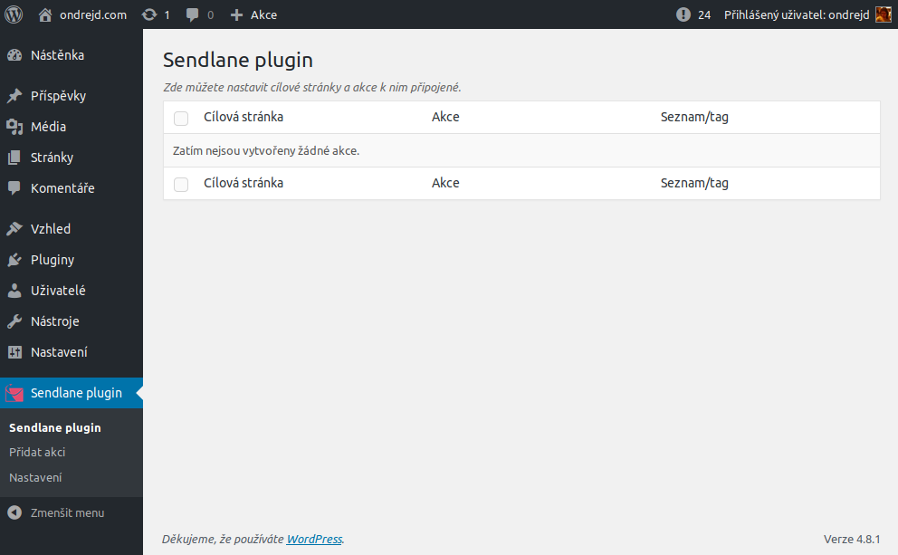
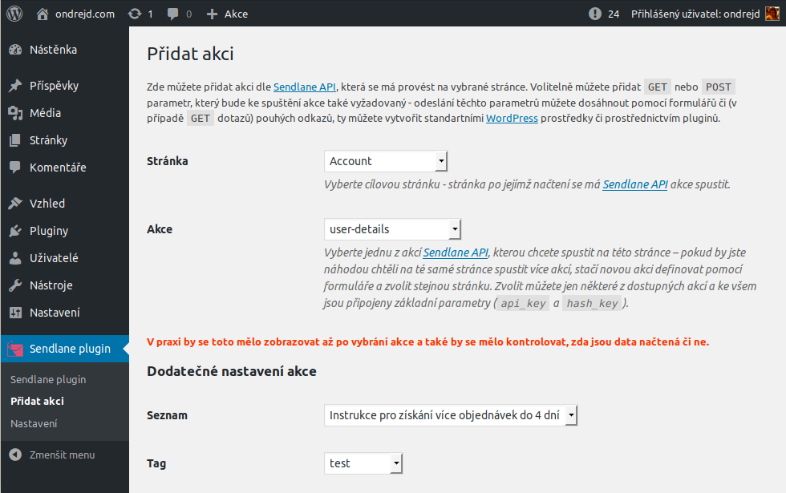
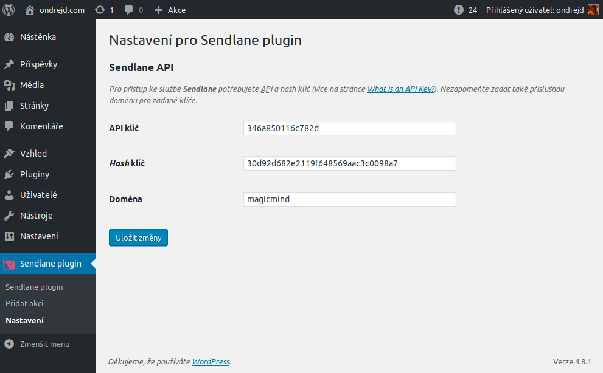

# Sendlane Plugin

Plugin that enables using [Sendlane][2] application for email automation in the [WordPress][1].

__Important:__ This plugin is still under development so not all features are implemented - that is marked by line-through the feature which is not done yet.

## Main features

- full implementation of [the Sendlane API][3]
- actions that can be triggered when page is loaded
- ~~widget for the subscription management~~
- ~~dashboard widget with statistics about usage of [Sendlane][2]~~

## Screenhots

### Actions list

### Add action

### Plugin options

[1]: https://wordpress.org/
[2]: https://sendlane.com/
[3]: http://help.sendlane.com/knowledgebase/api-docs/
